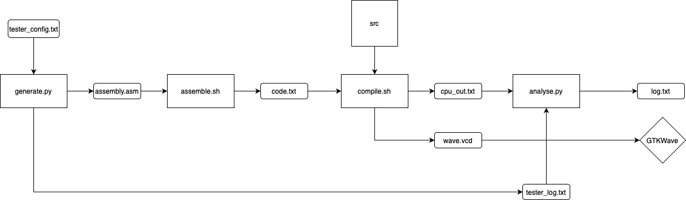

# CO_tester

> repo: https://github.com/FyVoid/BUAA_CO_tester

本项目包括

* python实现的MIPS汇编程序生成程序
* 一套利用mars命令行和iverilog对随机生成的程序进行汇编、仿真并输出结果的流程
* 可自定义的汇编指令生成、有一定扩展性

## 环境配置

完整运行此测试流程，你需要至少有

* iverilog
* java（支持mars）
* shell脚本支持

如果要通过gtkwave查看波形，则需要安装gtkwave并支持控制台命令gtkwave

## 太长不看

clone或从北航云盘下载后，将CO_tester和你的verilog源代码置于同一个目录，将verilog源码（应该包含一个能正常运行的testbench）置于src文件夹下，此时目录应该类似于：

```
.
├── CO_tester
│   ├── CO_test.sh
│   ├── README.md
│   ├── analyse.py
│   ├── assemble.asm
│   ├── assemble.sh
│   ├── compile.sh
│   ├── generate.py
│   ├── mars.jar
│   ├── pytester
│   │   ├── analyser.py
│   │   ├── hex2binary.py
│   │   ├── instruction.py
│   │   └── tester.py
├── src
│   ├── ... 你的verilog cpu源代码
│   ├── mips.v
│   ├── mips_tb.v	你的testbench（不需要同名）
```

在终端运行

```
sh CO_test.sh
```

程序会自动生成一个mips程序assemble.asm

mars命令行会将该程序转化为code.txt，随后iverilog会编译verilog源码，并生成波形和cpu输出（存于cpu_output.txt)，python程序会对比verilog输出和mars源码，输出对应关系于log.txt，gtkwave会自动启动并显示波形

log.txt应该类似这样

```
lui, $t9, 0x365a         <=>     @00003000: $25 <= 365a0000
ori, $v0, $a2, 0x8917    <=>     @00003004: $ 2 <= 00008917
ori $t0, $zero, 0x37e8   <=>     @00003008: $ 8 <= 000037e8
lw, $a1, -2744($t0)      <=>     @0000300c: $ 5 <= 00000000
ori $t0, $zero, 0x2d30   <=>     @00003010: $ 8 <= 00002d30
lw, $v0, 0($t0)          <=>     @00003014: $ 2 <= 00000000
ori, $t0, $v1, 0x1849    <=>     @00003018: $ 8 <= 00001849
sub, $s3, $t3, $a3       <=>     @0000301c: $19 <= 00000000
ori, $t9, $t1, 0x482b    <=>     @00003020: $25 <= 0000482b
add, $s5, $t3, $t2       <=>     @00003024: $21 <= 00000000
add, $t4, $s0, $t9       <=>     @00003028: $12 <= 0000482b
ori $t0, $zero, 0x1db8   <=>     @0000302c: $ 8 <= 00001db8
sw, $t5, -3580($t0)      <=>     @00003030: *00000fbc <= 00000000
lui, $v0, 0x7c91         <=>     @00003034: $ 2 <= 7c910000
......
```

整个测试逻辑图如下，各个组件可以分开使用



## 高级功能

事实上，你可以通过一定的修改来自定义汇编程序的生成，可以自定义的部分包括

* 自定义新指令
* 自定义每个指令生成概率
* 自定义某些行为的概率（如跳转和内存存取）
* 自定义生成程序的指令条数

### 自定义新指令

通过调整tester_config.txt的内容，你可以减少/添加已有的指令，控制每个指令生成的概率，**甚至自定义新的指令**

指令的格式为

```
[指令名] [参数1], (参数2), (参数3) | (output), (prob:生成概率)
```

指令名可以是任何合理的名字

参数可选的值如下

| 参数  | 效果                                                         |
| ----- | ------------------------------------------------------------ |
| $reg  | 随机产生\$t, \$s, \$a, \$v中的寄存器                         |
| $t    | 随机产生$t0-\$t9                                             |
| $s    | 随机产生\$s0-\$s7                                            |
| $a    | 随机产生$a0-\$a3                                             |
| $v    | 随机产生\$v0 or \$v1                                         |
| $im   | 随机产生范围为0-0xffff的立即数                               |
| $lb   | 随机产生跳转标签、标签可能是已经存在的标签，也可能是新的标签，这个概率由generate.py中的参数决定 |
| $rega | 随机产生一个形如offset($t0)的地址，地址的值（即offset+\$t0)可能是先前使用过的地址，也可能是新的地址，如果是已经产生过的地址，则一定为0(\$t0) |

`$rega`一定会在存取指令前产生一条`ori`指令，保证地址对齐

**指令结尾的`|`是必须的**，如果其后有`output`，表示该条指令会导致verilog仿真产生输出（根据CO课程规则），如果有`prob`，表示该指令的概率人为制定，格式为`prob:(0-1的数)f`，**结尾的`f`是必须的**

如果所有指令概率和>1或所有指令概率和<=1且每条指令均被指定概率，则每条指令概率为该条指令概率/总概率

否则，未指定概率指令概率为(1-已指定指令概率和)/(未指定概率指令数)

### 自定义生成概率和生成数量

generate.py文件中

```
gen_label_prob = 0.2		# 产生新标签的概率
former_addr_prob = 0.5	# 产生新地址的概率
total_instruct = 114		# 总的指令数量，由于$rega会产生ori，不是确定数量(可能+1)
```

## 最后

想了很久没有想到很好的验证verilog输出正确性的方法（在不存在已验证的cpu程序的情况下），如果有同学有好的想法欢迎讨论

该自动化程序会继续更新适用新的课程要求