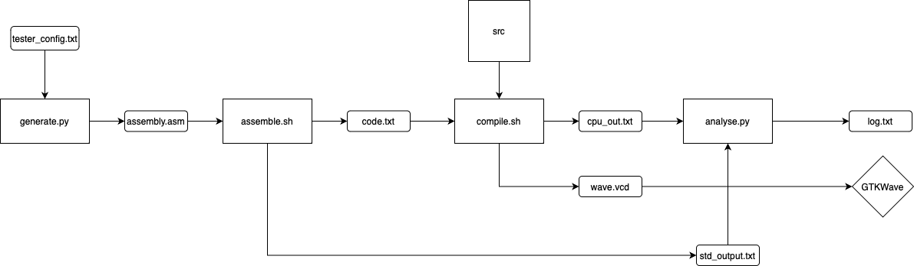

# CO_tester

> repo: https://github.com/FyVoid/BUAA_CO_tester

本项目包括

* python实现的MIPS汇编程序生成程序
* 一套利用mars命令行和iverilog对随机生成的程序进行汇编、仿真并输出结果的流程
* 可自定义的汇编指令生成、有一定扩展性
* 通过魔改版MARS进行正确性验证

## 环境配置

完整运行此测试流程，你需要至少有

* iverilog
* java（支持mars）
* shell脚本支持(windows可以尝试使用git bash)

如果要通过gtkwave查看波形，则需要安装gtkwave并支持控制台命令gtkwave

## 太长不看

clone或从北航云盘下载后，将CO_tester和你的verilog源代码置于同一个目录，将verilog源码（应该包含一个能正常运行的testbench）置于src文件夹下，此时目录应该类似于：

```
.
├── CO_tester
│   ├── CO_test.sh
│   ├── README.md
│   ├── analyse.py
│   ├── assemble.asm
│   ├── assemble.sh
│   ├── compile.sh
│   ├── generate.py
│   ├── mars.jar
│   ├── pytester
│   │   ├── analyser.py
│   │   ├── hex2binary.py
│   │   ├── instruction.py
│   │   └── tester.py
├── src
│   ├── ... 你的verilog cpu源代码
│   ├── mips.v
│   ├── mips_tb.v	你的testbench（不需要同名）
```

在终端运行

```
sh CO_test.sh
```

程序会自动生成一个mips程序assemble.asm

mars命令行会将该程序转化为code.txt，随后iverilog会编译verilog源码，并生成波形和cpu输出（存于cpu_output.txt)，python程序会对比verilog输出和魔改版MARS产生的标准输出，输出对应关系于log.txt，gtkwave会自动启动并显示波形

log.txt应该类似这样

```
@00003000: $18 <= 29a30000        <=>    @00003000: $18 <= 29a30000
@00003004: $ 3 <= 0000a435        <=>    @00003004: $ 3 <= 0000a435
@00003008: $ 8 <= 0000009c        <=>    @00003008: $ 8 <= 0000009c
@0000300c: *00000dd0 <= 0000a435  <=>    @0000300c: *00000dd0 <= 0000a435
@00003010: $ 6 <= 54b80000        <=>    @00003010: $ 6 <= 54b80000
@00003014: $ 2 <= 0000d7a6        <=>    @00003014: $ 2 <= 0000d7a6
@00003018: $ 3 <= 00000000        <=>    @00003018: $ 3 <= 00000000
@00003020: $22 <= b16e0000        <=>    @00003020: $22 <= b16e0000
@00003028: $31 <= 0000302c        <=>    @00003028: $31 <= 0000302c
@000030d8: $20 <= 0000a3a3        <=>    @000030d8: $20 <= 0000a3a3
@000030dc: $ 4 <= ffff285a        <=>    @000030dc: $ 4 <= ffff285a
@000030e0: $23 <= 00000000        <=>    @000030e0: $23 <= 00000000
@000030e4: $ 6 <= 00000000        <=>    @000030e4: $ 6 <= 00000000
@000030e8: $ 7 <= 00000000        <=>    @000030e8: $ 7 <= 00000000
@000030ec: $ 8 <= 00000dd0        <=>    @000030ec: $ 8 <= 00000dd0
@000030f0: *00000dd0 <= 00000000  <=>    @000030f0: *00000dd0 <= 00000000
@000030f4: $20 <= 00000000        <=>    @000030f4: $20 <= 00000000
@000030f8: $19 <= 0000b631        <=>    @000030f8: $19 <= 0000b631
@000030fc: $11 <= ffff2d7f        <=>    @000030fc: $11 <= ffff2d7f
@00003100: $ 8 <= 00000898        <=>    @00003100: $ 8 <= 00000898
@00003104: *000008e8 <= 00000000  <=>    @00003104: *000008e8 <= 00000000
@00003108: $ 8 <= 00000394        <=>    @00003108: $ 8 <= 00000394
@0000310c: $23 <= 00000000        <=>    @0000310c: $23 <= 00000000
@00003110: $31 <= 00003114        <=>    @00003110: $31 <= 00003114
@000031c8: *000007f4 <= 29a30000  <=>    @000031c8: *000007f4 <= 29a30000
@000031cc: $ 2 <= 0000142a        <=>    @000031cc: $ 2 <= 0000142a
@000031d0: $20 <= 0000b631        <=>    @000031d0: $20 <= 0000b631
END
All Correct Nya!
```

整个测试逻辑图如下，各个组件可以分开使用



## 高级功能

事实上，你可以通过一定的修改来自定义汇编程序的生成，可以自定义的部分包括

* 自定义新指令
* 自定义每个指令生成概率
* 自定义某些行为的概率（如跳转和内存存取）
* 自定义生成程序的指令条数

### 自定义新指令

通过调整tester_config.txt的内容，你可以减少/添加已有的指令，控制每个指令生成的概率，**甚至自定义新的指令**

指令的格式为

```
[指令名] [参数1], (参数2), (参数3) | (output), (prob:生成概率)
```

指令名可以是任何合理的名字

参数可选的值如下

| 参数  | 效果                                                         |
| ----- | ------------------------------------------------------------ |
| $reg  | 随机产生\$t, \$s, \$a, \$v中的寄存器                         |
| $t    | 随机产生$t0-\$t9                                             |
| $s    | 随机产生\$s0-\$s7                                            |
| $a    | 随机产生$a0-\$a3                                             |
| $v    | 随机产生\$v0 or \$v1                                         |
| $im   | 随机产生范围为0-0xffff的立即数                               |
| $lb   | 随机产生跳转标签、标签可能是已经存在的标签，也可能是新的标签，这个概率由generate.py中的参数决定 |
| $rega | 随机产生一个形如offset($t0)的地址，地址的值（即offset+\$t0)可能是先前使用过的地址，也可能是新的地址，如果是已经产生过的地址，则一定为0(\$t0) |

`$rega`一定会在存取指令前产生一条`ori`指令，保证地址对齐

**指令结尾的`|`是必须的**，如果其后有`output`，表示该条指令会导致verilog仿真产生输出（根据CO课程规则），如果有`prob`，表示该指令的概率人为制定，格式为`prob:(0-1的数)f`，**结尾的`f`是必须的**

如果所有指令概率和>1或所有指令概率和<=1且每条指令均被指定概率，则每条指令概率为该条指令概率/总概率

否则，未指定概率指令概率为(1-已指定指令概率和)/(未指定概率指令数)

### 自定义生成概率和生成数量

generate.py文件中

```
gen_label_prob = 0.2		# 产生新标签的概率
former_addr_prob = 0.5	# 产生新地址的概率
total_instruct = 114		# 总的指令数量，由于$rega会产生ori，不是确定数量(可能+1)
```
### shell脚本命令行参数
* nw: 不自动开启gtkwave
* nl: log中不保存所有指令对应关系
* ns: 命令行不输出log
* dir \<dirname\>: 保存临时文件和log的目录

## 最后


* 现在采用学长开发的魔改版MARS生成

  * > https://github.com/Toby-Shi-cloud/Mars-with-BUAA-CO-extension

* 很快会更新批量测试相关功能

该自动化程序会继续更新适用新的课程要求